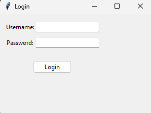
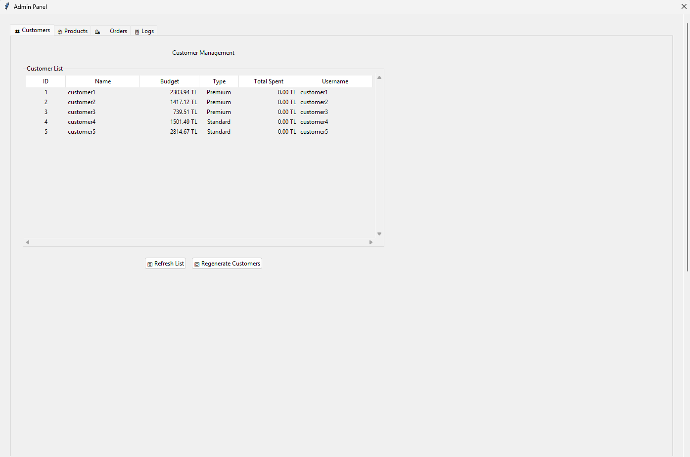
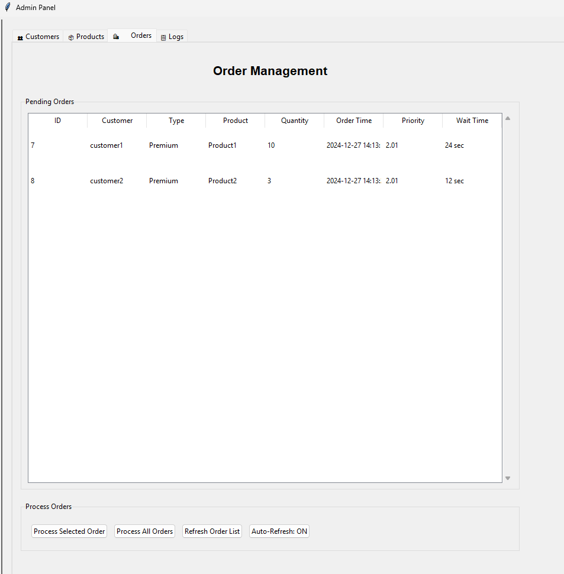

# Order Management System

A comprehensive order management system built with Python and Tkinter, featuring both admin and customer interfaces.

## Features

### Admin Panel
- Order processing with multi-threading support
- Dynamic order prioritization
- Real-time stock management
- Customer management
- Product management (add, update, delete)
- Order tracking and logs
- Stock visualization with charts

### Customer Panel
- Product browsing and ordering
- Order status tracking
- Account information
- Real-time updates

## Installation

1. Clone the repository:
```bash
git clone [repository-url]
cd order-management-system
```

2. Create and activate a virtual environment (recommended):
```bash
python -m venv venv
source venv/bin/activate  # On Windows: venv\Scripts\activate
```

3. Install required packages:
```bash
pip install -r requirements.txt
```

## Usage

1. Start the application:
```bash
python main.py
```

2. Login credentials:
- Admin:
  - Username: admin
  - Password: admin123
- Test Customer:
  - Username: customer1
  - Password: customer123

## Screenshots

### Login Screen


### Admin Panel


### Order Management


## Technical Details

- Built with Python 3.x
- GUI: Tkinter
- Database: SQLite
- Threading for concurrent order processing
- Priority queue for order management
- Real-time data visualization with Matplotlib

## Project Structure

```
order-management-system/
├── auth/
│   └── auth_manager.py
├── database/
│   └── db_manager.py
├── gui/
│   ├── admin_panel.py
│   └── customer_panel.py
├── screenshots/
├── main.py
├── requirements.txt
└── README.md
```

## Contributing

1. Fork the repository
2. Create your feature branch (`git checkout -b feature/AmazingFeature`)
3. Commit your changes (`git commit -m 'Add some AmazingFeature'`)
4. Push to the branch (`git push origin feature/AmazingFeature`)
5. Open a Pull Request

## License

This project is licensed under the MIT License - see the [LICENSE](LICENSE) file for details. 
